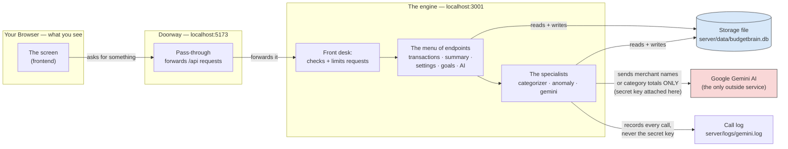

# BudgetBrain — How This App Works

**Who this document is for:** anyone who needs to understand this app — including people who have never written a line of code. It starts from zero, explains every technical word the first time it shows up, and builds up to the details a tester would need.

You should be able to read this once and then explain BudgetBrain out loud to someone else.

---

## 1. What is this app, in plain English?

BudgetBrain is a personal expense tracker that runs on your own computer. You feed it your spending — either by typing in a purchase, or by uploading the transaction file you download from your bank — and it shows you where your money went: how much you spent this month, which categories ate the most (groceries, dining, rent), and how that compares to the last six months. The clever part is that you don't have to label every purchase yourself. It sends the merchant names to Google's AI and gets back sensible categories automatically, so "NETFLIX.COM" becomes *Subscriptions* and "UBER \*TRIP" becomes *Transport*. It also quietly points out spending that looks unusual for you, suggests places to cut back, and tracks savings goals.

It's built for one person using it on one computer. There are no accounts, no passwords, no website to sign up for. Nothing about your finances leaves your machine except short merchant names and category totals sent to the AI — never your full transaction history.

---

## 2. The mental model: BudgetBrain is a restaurant

If you remember one thing from this document, make it this analogy. Every part of the app maps onto a part of a restaurant.

| Part of a restaurant | Part of BudgetBrain | What it actually is |
|---|---|---|
| **The dining room** — where you sit, read the menu, and place your order | The **frontend** | The screen you see in your web browser: the buttons, charts, and forms |
| **The waiter** — carries your order to the kitchen and brings food back | The **API** | The fixed set of requests the screen is allowed to make |
| **The kitchen** — does the actual cooking, customers never go in there | The **backend** | The program running invisibly in the background that does the real work |
| **The pantry / walk-in fridge** — where all the ingredients are stored | The **database** | A single file on your hard drive holding every transaction you've entered |
| **A specialist supplier you phone up** — e.g. calling a bakery for a custom cake | The **Gemini API** (Google's AI) | The one outside service the app talks to, over the internet |
| **The order slips the waiter writes** | **Endpoints** | The specific, named things you're allowed to ask for |
| **The kitchen's notebook of regular orders** | The **merchant cache** | A memory of merchants already categorized, so it doesn't re-ask the AI |

Two rules of this restaurant matter a lot:

1. **Customers never walk into the kitchen.** The screen you see never touches the stored data directly — it always asks the kitchen. This is why the secret password for the AI service can live safely in the kitchen and never be seen by customers.
2. **Only the kitchen phones the outside supplier.** When the AI needs to be consulted, the kitchen makes that call. The dining room never does.

---

## 3. The vocabulary, once and for all

You'll meet these words throughout the document. Here they are up front, in the order they matter.

- **Frontend** (*the dining room — everything the user sees and clicks*). In this app, it's a web page that runs in your browser at `http://localhost:5173`.
- **Backend** (*the kitchen — the behind-the-scenes engine the user never sees*). A program running quietly on your computer at `http://localhost:3001`, doing the calculating and remembering.
- **Database** (*the pantry — organized storage that survives after you close the app*). Here it's a single file: `server/data/budgetbrain.db`.
- **API** (*the waiter, plus the menu of things you're allowed to order*). The agreed list of requests the frontend can make of the backend, and what it gets back.
- **Endpoint** (*one specific item on that menu*). For example, "give me all transactions for March" is one endpoint; "delete transaction #42" is another.
- **Request / Response** (*placing an order / receiving the dish*). The frontend sends a request; the backend sends back a response.
- **Gemini API** (*the outside specialist you phone for one particular job*). Google's artificial-intelligence service. BudgetBrain uses it only to guess categories from merchant names and to write budget tips.
- **API key** (*your account number with that outside supplier — like a credit card number, it must stay secret*). A long secret string stored in a file called `server/.env` that only the backend can read.
- **`localhost`** (*"this very computer"*). A web address that points back at your own machine instead of out to the internet.
- **Port** (*a door number on your computer*). `:5173` and `:3001` are two different doors, so two programs can both listen without colliding.

Everything else is explained in the **Glossary** at the end.

---

## 4. How to start it up

Open a terminal (*the text-based way of giving your computer commands*) in the project folder and run:

```bash
npm install
```

That downloads the building blocks the app depends on. You only do it once.

```bash
cp server/.env.example server/.env
```

That creates the secret-settings file. Then open `server/.env` in a text editor and paste in your free Google Gemini key. **This step is optional** — skip it and everything still works except the AI features.

```bash
npm run seed
```

Optional. Fills the app with about 100 fake transactions so the charts have something to show.

```bash
npm run dev
```

This starts both halves at once — the kitchen and the dining room. Then open **http://localhost:5173** in your browser.

**What "no API key" looks like:** the app runs completely normally, a yellow banner appears explaining the key is missing, imported transactions simply stay labeled `Uncategorized`, and the AI buttons show a clear error instead of freezing. This is deliberate, and it's an important thing to test.

---

## 5. Walkthrough #1: what happens when you add one expense

Say you spent $12.50 on lunch and you type it into the app. Here's every step, in order.

1. **You fill in the form and click Add.** You typed a date, the description "Chipotle", the amount 12.50, and picked "expense" rather than "income". This is all happening in the dining room — the frontend, in your browser.

2. **The frontend converts the money.** `12.50` becomes `1250`. The app never stores dollars-and-cents as a decimal number anywhere, because decimals in computers are famously prone to tiny rounding errors (a computer can end up thinking 0.1 + 0.2 = 0.30000000000000004). Storing whole *cents* — 1250, not 12.50 — avoids that entirely. This is why nearly every money field in this app is named something ending in `_cents`.

3. **The frontend sends a request to the backend.** The waiter takes the order to the kitchen. Specifically it sends the order slip `POST /api/transactions` carrying `{ date, description: "Chipotle", amount_cents: -1250 }`. The amount is negative because that's how this app records money going *out*; income is a positive number.

4. **The request travels through the proxy.** Because the dining room is at door `:5173` and the kitchen is at door `:3001`, there's a small pass-through that forwards anything starting with `/api` to the kitchen. From the browser's point of view, there's only one place to talk to. This is a development convenience, nothing more.

5. **The backend checks the order is valid.** Before touching anything, it verifies: is the date real, and not in the future? Is the description non-empty? Is the amount a whole number and not zero? If any check fails, it stops right there and sends back an explanation of exactly which field was wrong — it does not save a half-broken record.

6. **The backend writes it to the database.** The lunch goes into the pantry, as one new row in the `transactions` table, stamped with the current time and marked as `Uncategorized` (nobody has said what kind of spending it is yet) and `manual` (a human typed it, an AI didn't guess it).

7. **The backend sends the saved record back.** The response includes the ID number the database just assigned it — proof it really got stored.

8. **The screen updates.** The new transaction appears in your list and the summary numbers at the top recalculate. Done — the whole round trip takes a few thousandths of a second, because nothing left your computer.

**Notice what did *not* happen:** the AI was never involved. Adding an expense is purely local. Only categorization and budget tips ever reach out to the internet.

---

## 6. Walkthrough #2: what happens when the AI categorizes your spending

Now you've imported 200 transactions from your bank and they're all sitting there labeled `Uncategorized`. You click the **✨ Categorize** button.

1. **The frontend asks the backend to start a run.** It sends `POST /api/categorize`. Notice it doesn't wait for the answer — categorizing hundreds of transactions can take minutes, and a frozen screen would be miserable. The backend replies almost instantly with "started, here's the ID for this run," and gets to work in the background.

2. **The backend checks its own memory first (the cheapest step).** For every uncategorized transaction, it simplifies the merchant name down to a bare key: lowercase it, throw away digits and punctuation. So `"WALMART #4521"` and `"Walmart #7788"` both reduce to just `walmart`. Then it checks its notebook — the **merchant cache** — to see if it's already learned what `walmart` means. If yes, the category is applied instantly, marked as coming from `cache`, and **no AI call is made at all**. This is the single biggest cost-saver in the app.

3. **Whatever's left gets grouped into batches.** Unknown merchants are bundled into groups of at most 40, with duplicates removed inside each group — if `starbucks` appears eleven times, the AI is asked about it once and the answer is applied to all eleven.

4. **The backend phones Google, one batch at a time.** It sends only the merchant description strings — never amounts, never dates, never your full history — along with the exact list of 15 allowed categories, and instructions to reply with nothing but a structured list.

5. **It waits 5 seconds between calls.** Google's free tier allows roughly 15 calls per minute. The deliberate pause keeps the app comfortably under that limit instead of getting itself blocked.

6. **It reads the AI's answer defensively.** This matters. AI models are not perfectly obedient — they sometimes wrap answers in extra formatting, or invent a category that wasn't on the list. So the backend strips out any decorative wrapping, and if the AI says a transaction is "Coffee" (not one of the 15 allowed categories), it's silently converted to `Other`. If the reply is complete gibberish, it asks once more; if that also fails, those transactions just stay `Uncategorized` and the run continues. **The run is designed never to crash.**

7. **Results are saved twice.** Once onto the transactions themselves (marked `ai`, so you can always tell what a human chose versus what a machine guessed), and once into the merchant cache — so next month, `walmart` is free.

8. **When all batches are done, it checks for unusual spending.** This is pure arithmetic done locally, no AI involved: anything more than 3× the typical amount for its category, or any single expense over 30% of your stated monthly income, gets flagged for your attention.

9. **Meanwhile, the screen has been checking in.** About once a second the frontend asks `GET /api/categorize/status` and gets back a progress report — "batch 3 of 5, 40 from cache, 112 from AI" — which is what drives the progress bar you're watching.

**If Google is unreachable or your key is wrong:** the backend waits and retries (15 seconds, then 30), and if it still fails, it stops, leaves the remaining transactions as `Uncategorized`, and puts a plain-English explanation in the status report. Your data is never lost or corrupted — the batches that already succeeded stay done.

---

## 7. The system, as a diagram

Boxes are the parts of the system; arrows are information moving between them.



**Three promises this diagram is making**, each of which you can verify yourself:

- The secret API key exists only inside the engine. It never appears on screen, never in a response, never in the log file.
- The browser never phones Google directly. Open your browser's developer tools, watch the network activity, use every feature — every request should go to `localhost` and nowhere else.
- Only two kinds of information ever reach Google: a list of merchant names, or a list of category totals. Never your transaction history.

### The import-then-categorize journey, step by step

This is the most involved sequence in the app. Read it top to bottom; each arrow is one message.

```mermaid
sequenceDiagram
    participant U as You
    participant FE as The screen
    participant API as The engine
    participant DB as Storage
    participant GM as Google Gemini

    U->>FE: paste or upload a bank CSV file
    FE->>FE: read the first 20 rows to show a preview
    U->>FE: confirm which column is date/description/amount
    FE->>API: POST /api/transactions/import (all the rows)
    API->>DB: check and save each row; bad rows skipped, not fatal
    API-->>FE: "142 imported, 3 skipped, 2 look like duplicates"
    U->>FE: click "Categorize"
    FE->>API: POST /api/categorize
    API-->>FE: "started" (returns immediately)
    API->>DB: check merchant cache — free instant matches
    loop for each batch of up to 40 unknown merchants
        API->>GM: here are the names, which categories?
        GM-->>API: a list of categories
        API->>DB: save categories + remember merchants for next time
        API->>API: pause 5 seconds (stay under the free limit)
    end
    API->>DB: flag unusual spending (local math, no AI)
    loop about once a second
        FE->>API: GET /api/categorize/status
        API-->>FE: progress: batches done, from cache, from AI, errors
    end
```

---

## 8. Where everything lives (the folder structure)

The project is split into two main folders, matching the restaurant analogy: `client/` is the dining room, `server/` is the kitchen.

```
budgetbrain/
├── package.json                 # the master control panel: `npm run dev` starts both halves at once
├── README.md                    # short setup instructions
├── budgetbrain-requirements.md  # the original spec the app was built from
│
├── client/                      # THE DINING ROOM — everything you see in the browser
│   ├── vite.config.ts           #   settings: run on door 5173, forward /api requests to door 3001
│   ├── src/
│   │   ├── main.tsx             #   the starting point that puts the page on screen
│   │   ├── App.tsx              #   the outer shell: the four tabs and the top banner
│   │   ├── pages/               #   one file per tab
│   │   │   ├── DashboardPage.tsx    the main screen: totals, charts, transaction list, categorize button
│   │   │   ├── ImportPage.tsx       the CSV upload flow: paste → match columns → import
│   │   │   ├── GoalsPage.tsx        savings goals and progress bars
│   │   │   └── SettingsPage.tsx     your monthly income and currency symbol
│   │   ├── components/          #   reusable visual pieces: charts, forms, pop-up messages,
│   │   │                        #   summary cards, and a decorative 3D coin jar
│   │   └── lib/                 #   small helper toolkits
│   │       ├── api.ts               the one place that talks to the engine — every request goes through here
│   │       ├── csv.ts               reads spreadsheet files
│   │       ├── money.ts             turns 1250 into "$12.50" and back
│   │       ├── categories.ts        the category list and each one's color
│   │       └── types.ts             a written description of what the engine's answers look like
│   └── dist/                    #   the packaged-up version for production (auto-generated, not written by hand)
│
└── server/                      # THE KITCHEN — the engine you never see
    ├── .env                     #   THE SECRET FILE: your Gemini key lives here and nowhere else
    ├── .env.example             #   a blank template of the above, safe to share
    ├── data/budgetbrain.db      #   THE PANTRY: every transaction, goal and setting, in one file
    ├── logs/gemini.log          #   a receipt for every AI call made (time, size, outcome — never the key)
    └── src/
        ├── index.ts             #   the front desk: starts the engine, sets limits, directs traffic
        ├── db.ts                #   opens the storage file and sets up its structure on first run
        ├── schemas.ts           #   the rulebook: what counts as a valid request
        ├── seed.ts              #   `npm run seed` — fills storage with ~100 fake transactions
        ├── routes/              #   THE MENU: one file per group of things you can ask for
        │   ├── transactions.ts      add, list, edit, delete, bulk-import transactions
        │   ├── summary.ts           the dashboard's totals and charts
        │   ├── settings.ts          income and currency
        │   ├── goals.ts             savings goals and the math about them
        │   └── ai.ts                the AI-powered requests and the flagging ones
        ├── services/            #   THE SPECIALISTS: the harder logic, kept separate
        │   ├── gemini.ts            the only file that ever phones Google; handles retries and messy replies
        │   ├── categorizer.ts       runs a categorization job: check cache → batch → ask AI → save
        │   └── anomaly.ts           spots unusual spending using arithmetic only, no AI
        └── lib/                 #   tiny shared tools
            ├── categories.ts        the official list of 15 categories
            ├── normalize.ts         "WALMART #4521" → "walmart"
            └── dates.ts             date arithmetic
```

---

## 9. What's stored, and where

Everything lives in one file on your disk: `server/data/budgetbrain.db`. It's a **SQLite database** (*a whole database contained in a single file, rather than a separate program running on a server*). Delete that file and the app rebuilds an empty one next time it starts.

Inside, information is organized into **tables** (*think of each one as a spreadsheet with fixed column headings*):

| Table | What it holds | Its main columns |
|---|---|---|
| `transactions` | Every purchase and paycheck | `date`, `description`, `amount_cents` (negative = money out, positive = money in), `category`, `category_source` (was this labeled by a human, the AI, or the cache?), `flagged`, `flag_reason`, `flag_dismissed` |
| `merchant_category_cache` | What it's learned about merchants | `merchant_key` (the simplified name), `category`, `hit_count` (how often it saved an AI call) |
| `settings` | Your preferences | `monthly_income_cents`, `currency_symbol` |
| `goals` | Savings goals | `name`, `target_cents`, `deadline`, `created_at` |
| `suggestions_cache` | Previously-generated budget tips | keyed by month + a fingerprint of the data, so identical requests are free |

**The 15 categories.** This list is fixed and the AI is strictly held to it — if it ever invents something outside this list, the answer is converted to `Other`:

`Groceries · Dining · Entertainment · Transport · Utilities · Rent/Mortgage · Shopping · Health · Subscriptions · Travel · Income · Transfers · Fees · Other · Uncategorized`

**Two rules that explain surprising numbers.** If totals ever look "wrong" to you, it's probably one of these working as designed:

- **Transfers are ignored everywhere.** Moving $500 from checking to savings isn't spending, so it's left out of totals, charts, savings velocity, and unusual-spending checks.
- **Income and Transfers are left out of the category pie chart**, since a pie of "where my spending went" shouldn't have a giant "paycheck" slice.

---

## 10. The API: every request you can make

**What an endpoint is:** one specific request the engine knows how to answer — one item on the menu. Each has a *method* (the kind of action) and a *path* (the thing being acted on).

The four methods you'll see:

- **GET** — *"show me something."* Reads data, changes nothing. Safe to repeat.
- **POST** — *"create something new"* (or "start a job").
- **PATCH** — *"change part of something that already exists."*
- **PUT** — *"save these settings."*
- **DELETE** — *"remove this."*

So `GET /api/transactions` means "show me the transactions," and `DELETE /api/transactions/42` means "delete transaction number 42."

**Status codes** are the engine's short verdict on how it went. `200` = fine. `201` = created it. `202` = started working on it. `204` = done, nothing to send back. `400` = *you* sent something invalid. `404` = that thing doesn't exist. `409` = conflict, something's already in progress. `429` = you're asking too fast. `500`/`502` = something went wrong on the engine's side.

**How to test these directly.** You don't need the browser screen at all — you can talk to the engine yourself. For example:

```bash
curl http://localhost:3001/api/health
```

Base address for everything below: `http://localhost:3001/api`

**Conventions that apply to all of them:**
- Information goes back and forth as JSON (*a simple text format for structured data — labeled values in curly braces*).
- Every money value is a whole number of cents. `$12.50` is always `1250`, never `12.50`.
- If you send something invalid, you get a `400` plus a note about exactly which field was wrong: `{ "error": "...", "fields": { "date": "Date cannot be in the future" } }`.
- Asking for a path that doesn't exist gives `404 { "error": "Not found" }`.
- If the engine hits an unexpected problem it returns a generic `500 { "error": "Internal server error" }` — deliberately vague, so internal details never leak out.
- There's a speed limit of 300 requests per minute across the whole API; exceed it and you get `429`.

---

### Health check

#### `GET /api/health`
Is the engine alive, and does it have an AI key?

- **200** → `{ "ok": true, "gemini_key_configured": true/false, "time": "<timestamp>" }`
- *Try this:* stop the engine and reload the page — the screen should say "The server's not answering," not hang forever.

---

### Transactions

#### `GET /api/transactions`
List transactions, 50 at a time, newest first.

Optional filters you can add to the address: `month=YYYY-MM` · `category=<one of the 15>` · `search=<text found in the description>` · `page=<number, starts at 1>` · `flagged=1`

- **200** → `{ "rows": [...], "total": 137, "page": 1, "page_size": 50, "page_count": 3 }`
- **400** if a filter is malformed.

#### `POST /api/transactions`
Add one transaction.

Send: `{ "date": "2026-08-16", "description": "Chipotle", "amount_cents": -1250, "category": "Dining" }` (category is optional and defaults to `Uncategorized`).

- **201** → the newly saved record, including its new ID.
- **400** if the date is in the future or invalid, the description is empty or over 500 characters, the amount is zero or has a decimal point, or the category isn't one of the 15.
- *Good things to try:* send `amount_cents: 19.99` (should be rejected — it must be `1999`), send `0`, send tomorrow's date. All three should fail cleanly.

#### `POST /api/transactions/import`
Add many transactions at once. This is what the CSV screen uses.

Send: `{ "rows": [ {...}, {...} ] }` — up to 1,000 rows.

- **200** → `{ "imported": 142, "skipped": [{ "row": 7, "reason": "date: Date cannot be in the future" }], "duplicates": [{ "row": 12, "description": "SHELL OIL" }] }`
- **400** only if the whole package is malformed or has more than 1,000 rows.
- **Bad rows never stop the import.** They're skipped and reported individually, with row numbers counting from 1.
- **Duplicates are imported anyway, just reported.** If a row matches an existing transaction on date, amount and merchant, you get a warning — not a block. The reasoning: it's genuinely common to buy the same coffee twice in a day, and wrongly blocking a real transaction is worse than mentioning a suspected repeat.
- *Good things to try:* send 1,001 rows (expect rejection); send 5 good rows and 2 broken ones (expect `imported: 5` and exactly 2 entries in `skipped`).

#### `PATCH /api/transactions/:id`
Change one or more fields of an existing transaction. Send only the fields you want changed.

- **200** → the updated record. **400** if empty or invalid. **404** if that ID doesn't exist.
- **Important side effect:** if you change the *category*, the engine treats your choice as authoritative — it marks the source as `manual` and **teaches the merchant cache**. From then on, that merchant is categorized for free forever.
- *Good test:* manually set "STARBUCKS #123" to *Dining*, then run categorization on an uncategorized "STARBUCKS #456". It should come back labeled from `cache`, with no new line appearing in `server/logs/gemini.log`.

#### `DELETE /api/transactions/:id`
- **204** with an empty response on success. **404** if it doesn't exist.

---

### The dashboard numbers

#### `GET /api/summary`
Everything the dashboard displays, calculated by the database itself rather than in the browser.

Optional: `month=YYYY-MM` (defaults to the current month).

- **200** →
```json
{
  "month": "2026-08",
  "spent_cents": 284350,
  "income_cents": 520000,
  "net_cents": 235650,
  "flagged_count": 3,
  "by_category": [{ "category": "Rent/Mortgage", "spent_cents": 150000 }],
  "six_month_series": [{ "month": "2026-03", "spent_cents": 301200 }]
}
```
- `by_category` leaves out `Income` and `Transfers`, biggest first.
- `six_month_series` always contains exactly 6 entries — the chosen month plus the 5 before it — filled with zeros where there's no data, so the bar chart never has gaps.
- ⚠️ **`flagged_count` counts flagged transactions across all time, not just the chosen month.** Easy to misread as a bug when testing.

---

### Settings

#### `GET /api/settings`
- **200** → `{ "monthly_income_cents": 520000, "currency_symbol": "$" }` (income is `null` until you set it).

#### `PUT /api/settings`
Send either or both fields: `{ "monthly_income_cents": 520000, "currency_symbol": "$" }`
- **200** → the full updated settings. **400** if invalid.
- Your income matters beyond display: it powers the "any single expense over 30% of income" flag, and budget suggestions refuse to run without it.

---

### The AI features

#### `POST /api/categorize`
Start labeling every `Uncategorized` transaction. Returns immediately — it does not wait for the AI.

- **202** → `{ "run_id": "<unique id>" }`
- **409** → `{ "error": "A categorization run is already in progress" }` — only one job can run at a time.
- *Important test — with a missing or invalid key:* this must still return `202` and finish with status `done`, leaving transactions `Uncategorized` and putting a readable explanation in the status report. It must never hang or return a `500`.

#### `GET /api/categorize/status`
The progress report. Ask this repeatedly while a job runs.

- **200** →
```json
{
  "run_id": "abc-123",
  "status": "idle | running | done",
  "total_transactions": 200,
  "cached_count": 40,
  "ai_count": 152,
  "fallback_count": 8,
  "batches_total": 5,
  "batches_done": 5,
  "batches_skipped": 0,
  "errors": [],
  "started_at": "<timestamp>",
  "finished_at": "<timestamp>"
}
```
- `cached_count` = free, from memory. `ai_count` = labeled by Google. `fallback_count` = the AI didn't give a usable answer, so they stayed `Uncategorized`.
- There is only ever one status, shared app-wide — it's not per-user or per-browser-tab.

#### `POST /api/suggestions`
Ask the AI for 3–5 specific ideas for cutting spending.

Send: `{ "month": "2026-08" }` (optional, defaults to this month).

- **200** → `{ "suggestions": ["...", "..."], "cached": true/false }`
- **400** `{ "error": "income_not_set" }` — you must set your monthly income first.
- **400** `{ "error": "no_data" }` — no spending recorded for that month.
- **502** `{ "error": "suggestions_failed", "message": "..." }` — the AI couldn't be reached or gave nothing usable.
- **What gets sent to Google:** only your income and per-category totals. Not a single individual transaction.
- **Caching:** the answer is stored against a fingerprint of that data. Click the button five times without changing anything and only the first click costs an AI call; the rest return `cached: true` instantly. Change a category and the fingerprint changes, so you get fresh advice.

#### `POST /api/flags/recompute`
Redo the unusual-spending check. No AI, no body to send.

- **200** → `{ "flagged_count": 3 }`
- **The two rules:** an expense more than 3× the middle-of-the-road amount for its category over the last 90 days (only if there are at least 5 earlier transactions in that category to compare against — otherwise there's no meaningful "normal" yet), or any single expense over 30% of your monthly income.

#### `PATCH /api/flags/:id/dismiss`
Wave off a flag you don't care about.

- **200** → `{ "ok": true }`. **404** if the ID doesn't exist.
- **Dismissals are permanent by design.** The transaction is marked as dismissed, so later recomputes won't resurrect it — otherwise every recalculation would re-nag you about the same holiday flight forever. Worth testing: dismiss a flag, run `/api/flags/recompute`, confirm it stays gone.

---

### Savings goals

#### `GET /api/goals`
- **200** → `{ "velocity_weekly_cents": 42000, "goals": [ ... ] }`

Each goal comes back with its raw fields plus calculated ones:

```json
{
  "id": 1, "name": "Japan trip", "target_cents": 400000,
  "deadline": "2027-04-01", "created_at": "<timestamp>",
  "saved_cents": 120000,
  "remaining_cents": 280000,
  "weeks_left": 32.5,
  "required_weekly_cents": 8616,
  "velocity_weekly_cents": 42000,
  "projected_completion": "2026-12-14",
  "status": "done | on_track | behind | not_reachable"
}
```

Two things that surprise people:

- **`saved_cents` is not a stored balance.** There's no "put $50 toward Japan" feature. It's calculated fresh every time as your total net savings (money in minus money out, ignoring Transfers) since the day the goal was created, capped at the target. *Testing implication:* adding a transaction dated **before** a goal was created won't budge its progress; one dated after will.
- **`velocity_weekly_cents` is identical for every goal.** It's your overall average weekly savings over the last 8 weeks, not something per-goal.

#### `POST /api/goals`
Send: `{ "name": "Japan trip", "target_cents": 400000, "deadline": "2027-04-01" }`
- **201** → the goal with all its calculations. **400** if the name is empty, the target isn't a positive whole number, or the deadline isn't a valid date.

#### `PATCH /api/goals/:id`
Send any subset of those three fields. **200** / **400** / **404** as above.

#### `DELETE /api/goals/:id`
**204** on success, **404** if it doesn't exist.

---

## 11. A closer look at the AI connection

- **Which AI:** Google's `gemini-flash-latest` model, over the free tier. Changeable via `GEMINI_MODEL` in `server/.env`.
- **The only outside call this app ever makes:** `POST https://generativelanguage.googleapis.com/v1beta/models/{model}:generateContent`. The AI is told to answer in strict structured form with creativity turned all the way down — for a labeling task you want the same input to always produce the same output, not variety.
- **Exactly two places call it**, both inside the engine (`server/src/services/gemini.ts`):
  1. **Categorization** — up to 40 merchant names per call, plus the fixed category list.
  2. **Suggestions** — only the month, your income, and per-category totals.
- **Defensive reading of replies.** The engine assumes the AI will occasionally misbehave: it strips decorative formatting the AI was told not to add, hunts for a valid list inside a messy reply, throws away nonsense entries, and converts any invented category to `Other`.
- **When things fail.** A garbled reply gets one retry. A "too many requests" or server error waits 15 seconds, then 30, for up to 3 attempts — then abandons the *remaining* batches and reports it plainly. Work already completed is kept, never rolled back.
- **The paper trail.** Every call, successful or not, adds one line to `server/logs/gemini.log` with the time, the batch size, and the outcome. The secret key is never written there. This file is the fastest way to prove whether the cache is working: run categorization twice and check that the second run adds no new lines.

---

## 12. Testing checklist

Each item is something you can verify from outside the code — by clicking around, using `curl`, or reading `server/logs/gemini.log`.

**Basic setup**
- [ ] A fresh copy with `npm install && npm run dev` and *no* API key gives a fully usable app, with a visible banner about the missing key.
- [ ] With the engine stopped, the screen shows a clear "can't reach the server" message rather than hanging or showing a blank page.

**Data validation**
- [ ] Adding a transaction rejects: future dates, an amount of zero, an amount with a decimal point, an empty description, an invalid category.
- [ ] Every error message names the specific field that was wrong.

**CSV import**
- [ ] A file with some broken rows imports the good ones and lists the bad ones with row numbers and reasons.
- [ ] More than 1,000 rows is refused outright with a clear message.
- [ ] Importing the exact same transaction twice is allowed, and reported as a suspected duplicate rather than blocked.

**The AI and its cache**
- [ ] Running categorization twice with no new data makes **zero** AI calls the second time — confirm by checking that `server/logs/gemini.log` gains no new lines.
- [ ] Manually setting a category, then categorizing a different transaction from the same merchant, resolves it from cache (`category_source: "cache"`, no log entry).
- [ ] Progress updates visibly during a long run rather than freezing.
- [ ] With a deliberately wrong API key: categorization completes with transactions left `Uncategorized` and a readable error; suggestions return a `502` with a readable message. Neither returns a `500`, and neither hangs.

**Calculations**
- [ ] Transfers never appear in spending totals, the 6-month chart, or savings velocity.
- [ ] The pie chart never contains an `Income` or `Transfers` slice.
- [ ] Every money value in every response is a whole number — the `$X.XX` formatting only ever happens on screen.
- [ ] Dismissing a flag and then recomputing leaves it dismissed.

**Privacy and security**
- [ ] The API key appears nowhere except `server/.env` — not on screen, not in any response, not in `server/logs/gemini.log`.
- [ ] With browser developer tools open, using every feature produces requests only to `localhost` — never directly to Google.
- [ ] Making more than 300 requests in a minute starts returning `429`.

---

## 13. Glossary

**AI key / API key** — A long secret string that identifies you to an outside service, like an account number. Anyone who has it can spend your quota, so it stays in `server/.env` and never leaves the engine.

**Anomaly flag** — A marker the app puts on a transaction that looks unusual for you, so it catches your eye. Calculated with ordinary arithmetic, not AI.

**API** — The fixed set of requests one program agrees to answer for another. The waiter and the menu, combined.

**Backend** — The program running behind the scenes that stores data and does the real work. The kitchen. Here, it's what lives in `server/`.

**Batch** — A group of items handled in one go, to be efficient. This app sends up to 40 merchant names per AI call rather than one call each.

**Cache** — Remembered results, kept so an expensive step doesn't have to be repeated. BudgetBrain caches merchant categories and budget suggestions.

**Cents (integer cents)** — Money stored as a whole number of cents (`1250`) rather than dollars with a decimal point (`12.50`), because computers make small rounding errors with decimals.

**CSV** — "Comma-separated values," a plain-text spreadsheet format. It's what banks let you download.

**`curl`** — A command-line tool for making a request to a web address without a browser. Handy for testing endpoints directly.

**Database** — Organized storage that persists after the program closes. The pantry.

**Endpoint** — One specific request an API can answer, written as a method plus a path, like `GET /api/transactions`.

**Frontend** — The part you see and interact with, running in your browser. The dining room. Here, everything in `client/`.

**Gemini API** — Google's artificial-intelligence service. BudgetBrain uses it for exactly two things: guessing categories from merchant names, and writing budget tips.

**GET / POST / PATCH / PUT / DELETE** — The kind of action a request performs: read / create / partially change / save settings / remove.

**JSON** — A simple text format for structured data, using labels and values inside curly braces. How the frontend and backend talk.

**`localhost`** — A web address meaning "this same computer." Nothing addressed to `localhost` travels over the internet.

**Merchant key** — A merchant name stripped down to its bare essentials (lowercase, no digits or punctuation), so `"WALMART #4521"` and `"Walmart #7788"` are recognized as the same shop.

**Migration** — An automatic setup step that creates or updates the structure of the database when the engine starts, so you never have to build it by hand.

**Port** — A numbered door on your computer, letting several programs listen for requests without interfering. This app uses `5173` and `3001`.

**Proxy** — A pass-through that forwards requests from one address to another. Here it lets the browser talk to a single address while requests quietly reach the engine on a different door.

**Rate limit** — A cap on how many requests are allowed in a period of time, to prevent overload. This app allows 300 per minute.

**Request / Response** — The message asking for something, and the message that comes back.

**Run (categorization run)** — One complete job of labeling all uncategorized transactions, from start to finish.

**Seed** — Filling an empty app with realistic fake data so you have something to look at while developing or testing.

**SQLite** — A database that lives entirely in one ordinary file, with no separate program to install or run. Ideal for an app meant to run on one person's computer.

**Status code** — A three-digit number summarizing how a request went. 200s mean success, 400s mean the request was wrong, 500s mean the engine had a problem.

**Table** — One collection of records inside a database, like a single sheet in a spreadsheet with fixed column headings.

**Validation** — Checking incoming data against rules before saving it, so bad data never reaches storage.
